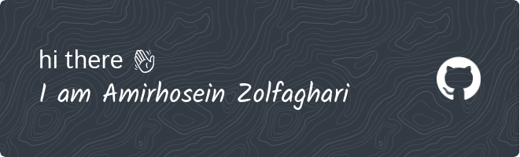

  
 

I am Amir Hossein, a student from Iran, 
where I live, the Internet is not very good, 
but I am very interested in self-learning from the Internet, 
and every time I encounter a problem, I immediately go to Google.

## Skills

 

## Contact
 
   

 
